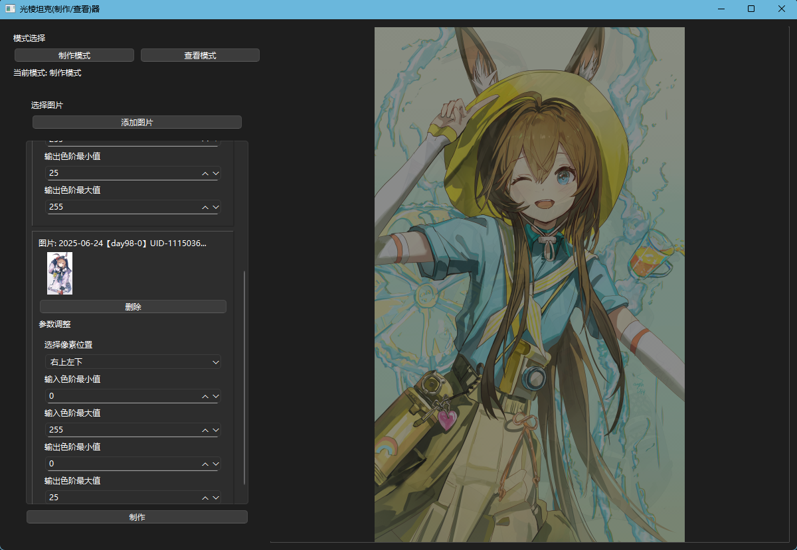
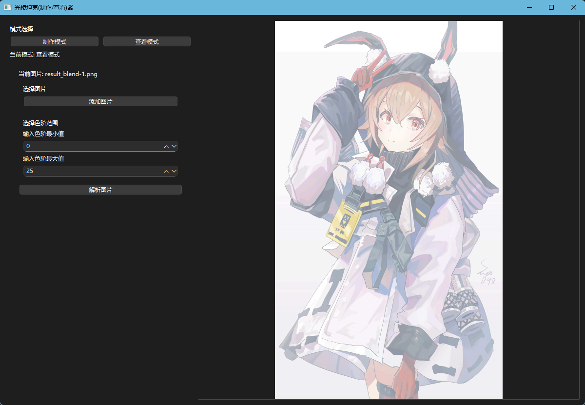
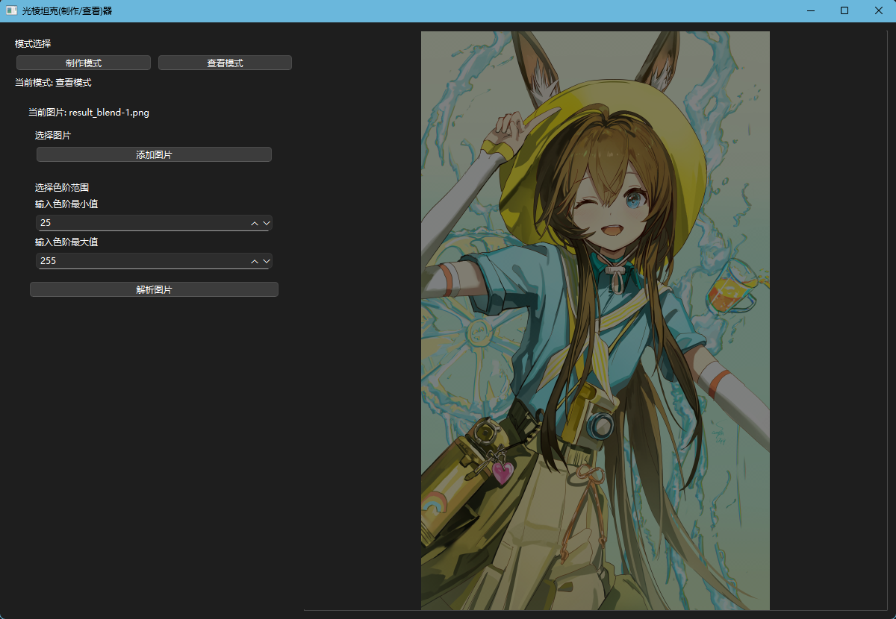

# GLTank - 光棱坦克图像处理工具

## 项目简介

一个基于Python的光棱坦克图像处理工具，主要用于生成和操作使用2x2像素核的光棱坦克图像。

当前版本仅支持CPU计算，暂不支持GPU加速。

## 系统要求

- Python 3.8+
- Windows系统
- 推荐配置：4核CPU，8GB内存

## 安装指南

1. 克隆或下载本项目到本地
2. 首次运行时：
   - 双击运行`启动应用.bat`
   - 双击运行`安装依赖.bat`
   - 等待依赖安装完成
3. 后续使用：
   - 直接运行`启动应用.bat`即可

## 使用说明

1. 启动应用后，选择要处理的图像
2. 调整光棱坦克参数：
   - 像素核大小(固定为2x2)
   - 亮度调节
   - 对比度调节
3. 点击"生成"按钮处理图像
4. 处理后的结果会自动保存在`output`文件夹中
5. 可以在应用中预览效果(如上图示例)

## 注意事项

- 处理大图像时可能需要较长时间
- 目前仅支持常见的图片格式(jpg/png等)
- 如需批量处理，请确保电脑有足够内存

## 预览图象

